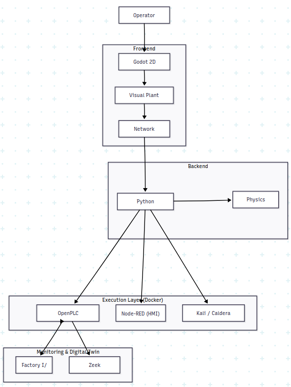
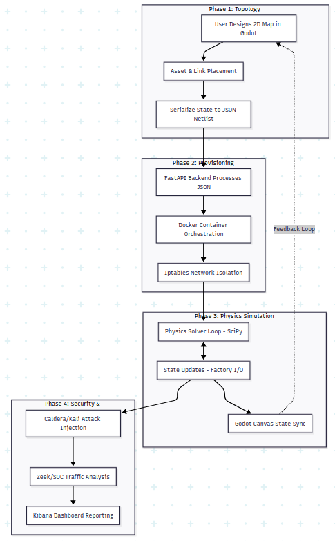
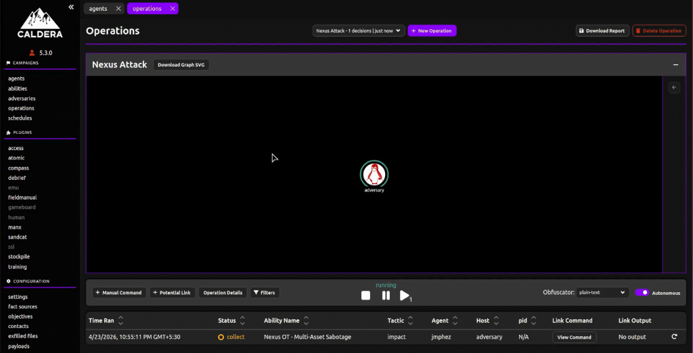
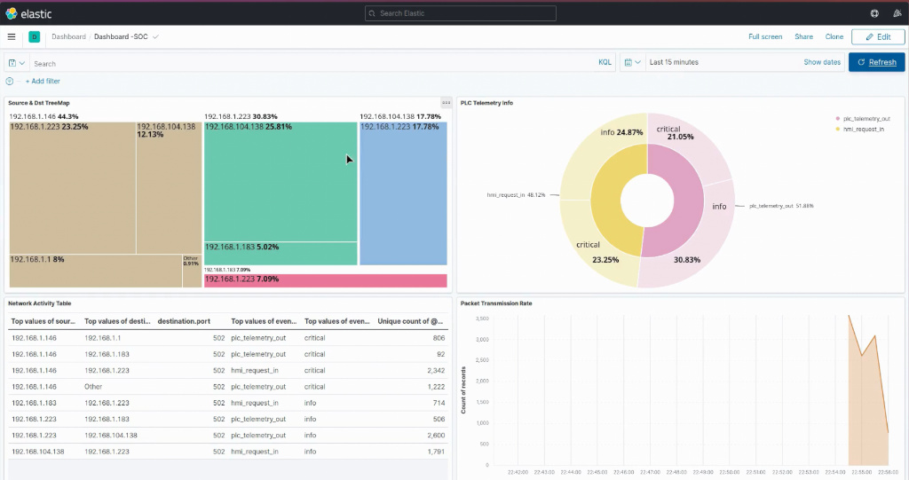
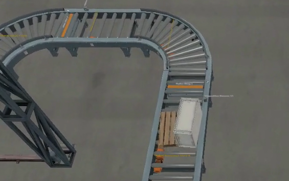

# Nexus-OT: Industrial Cybersecurity Cyber Range


Nexus-OT is a next-generation Industrial Cybersecurity Cyber Range developed as part of a Master's dissertation at the **National Forensic Sciences University (NFSU)**. It combines a visual network topology designer with a powerful infrastructure engine, allowing users to design OT environments, simulate physical processes, and deploy real-world containerized infrastructure for security testing and forensic analysis.

## 📐 System Architecture

The project follows a modular architecture that bridges visual design with live container orchestration.



### Core Components
- **Godot 4.5 Frontend**: A C#-powered graphical interface for designing Purdue Model compliant topologies.
- **FastAPI Backend**: Orchestrates Docker infrastructure and solves physical flow equations.
- **ELK Stack Monitoring**: Centralized logging for Zeek IDS and Modbus traffic analysis.
- **CALDERA C2**: Integrated adversary emulation for automated attack scenarios.

## 🔄 Workflow

The transition from a visual graph to a live cyber range is fully automated through a deterministic deployment pipeline.



1. **Design**: Create a topology in the Godot editor.
2. **Translate**: Backend generates `docker-compose.yml` and `iptables` rules.
3. **Deploy**: Containers are spun up with enforced network segmentation.
4. **Analyze**: Traffic is captured and indexed in the SOC dashboard.

## 🚀 Key Features

- **Visual Topology Designer**: Drag-and-drop interface for complex industrial networks.
- **Purdue Model Compliance**: Automatic classification of assets into Levels 0 to 5.
- **Live Physics Engine**: Real-time simulation of fluid dynamics and pressure equilibrium.
- **Integrated SOC**: Built-in packet sniffing with Scapy and log aggregation via ELK.
- **Adversary Emulation**: Automated attack scenarios using MITRE ATT&CK for ICS.

## 🛡️ Attack Automation & Results

Nexus-OT supports automated adversary emulation to test the resilience of OT infrastructure.



### SOC Monitoring & Dashboard
Real-time traffic analysis and attack detection are visualized through integrated Kibana dashboards.



### Physical Disruption Simulation
The system captures the physical impact of cyber-attacks on industrial processes, such as abnormal pressure spikes or actuator manipulation.



## 📁 Project Structure

```text
nexus-ot/
├── project.godot                  # Godot 4.5 project configuration
├── Nexus_OT.csproj               # .NET 8 C# project
├── GraphManager.cs               # Core logic for graph management
├── AssetNode.cs                  # Graphical representation of network assets
├── InspectorPanel.cs             # UI for modifying asset properties
├── docs/images/                  # System diagrams and screenshots
├── backend/                      # Backend services and infrastructure engine
│   ├── server.py                 # FastAPI server (API endpoint)
│   ├── infrastructure.py         # Docker Compose generation logic
│   ├── solver.py                 # Physics simulation engine
│   ├── soc.py                    # SOC monitoring and packet sniffing
│   └── images/                   # Custom Dockerfiles
└── 3D_Assets/                    # High-quality 3D models
```

## 🛠️ Implementation Steps

### 1. Environment Setup
Ensure you have the following installed:
- **Godot 4.5** (with .NET support)
- **Docker & Docker Compose**
- **Python 3.10+**

### 2. Launch Backend
```bash
cd backend
python3 -m venv venv
source venv/bin/activate
pip install -r requirements.txt
python3 server.py
```

### 3. Visual Design & Build
- Open `project.godot` in Godot.
- Click **Add Node** to place assets (PLC, HMI, Firewall, etc.).
- Connect nodes via the data link ports.
- Assign IPs and Roles in the **Inspector Panel**.
- Click **"Build Network"** to deploy.

## 📝 Dissertation Context

This project was developed for the Master's dissertation in **Digital Forensics and Information Security** at the **National Forensic Sciences University (NFSU)**. It serves as a platform for studying OT security, forensic artifacts in industrial networks, and the effectiveness of security monitoring in virtualized ICS environments.

## 📜 License

This project is released under the MIT License.
